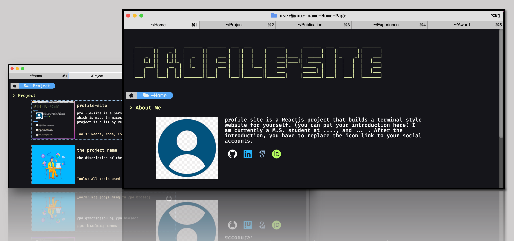
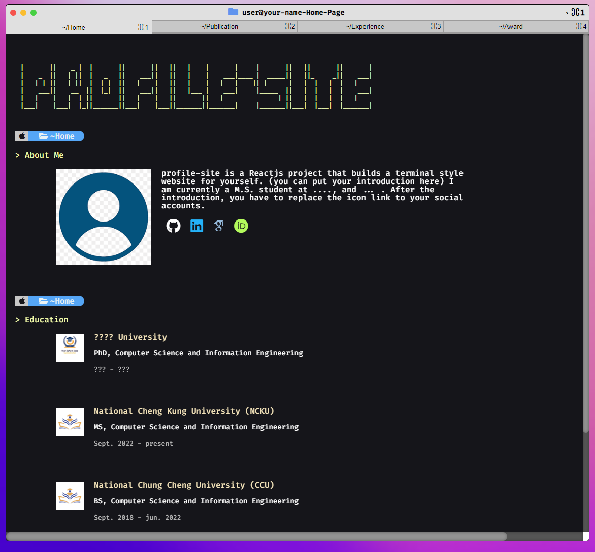
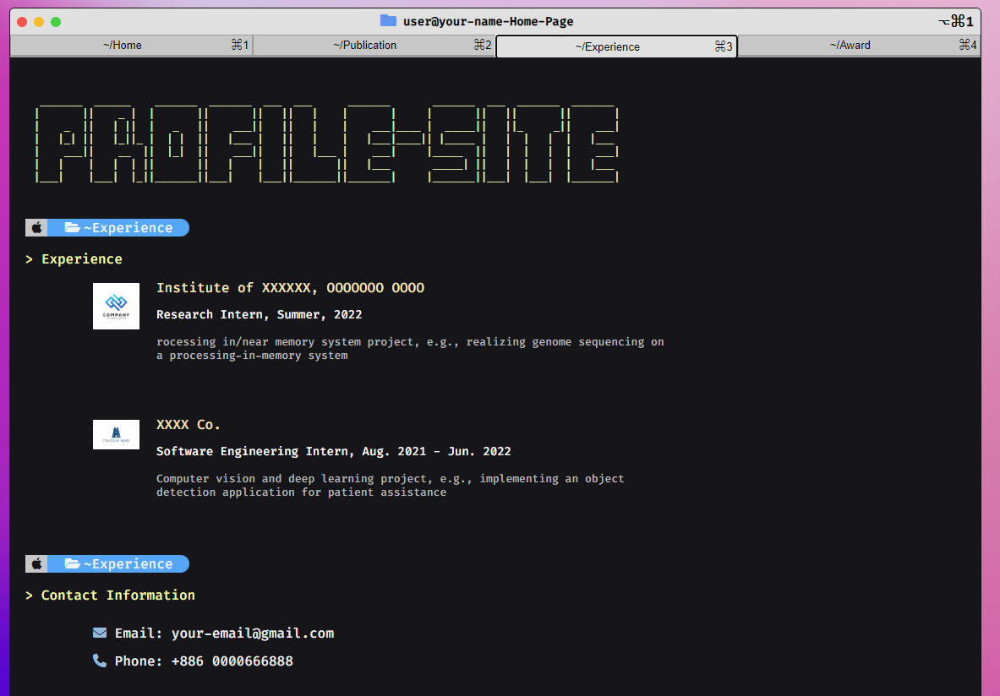

# profile-site

[](https://github.com/chi-0828/profile-site)


[](LICENSE)
<br>
[](https://docs.npmjs.com/)
[](https://nodejs.org/en)
<br>
profile-site is a template of MacOS terminal-style personal profile website

- star :star: this project if you enjoy this template

## [Update log](#update)
## [Try it out](#usage)

## Demo 
> #### Demo website link
> [see the demo website](https://chi-0828.github.io/profile-site/)

## Demo screenshot
#### Some demo images
ASCII art can be generated on an online tool, e.g., [patorjk](https://patorjk.com/software/taag/#p=display&f=Graffiti&t=Type%20Something%20)



## Usage
download the source
``` shell
git clone https://github.com/chi-0828/profile-site.git
```
run npm
``` shell
cd profile-site
npm install
npm run start
```
customize your website <br>
modify the title of `public/index.html`, change `User` to your name
``` html
<head>
    <meta charset="UTF-8">
    <!-- some codes -->
    <title>User</title>
    <!-- Put your name here -->
    <!-- some codes -->
</head>
```
`src/img/me5.png` is your personal image, `src/customization/*.json` is your personal information
``` shell
cd src/customization
# change the introduction in *.json to your own information
# change the images in img/* to your own photo and your school/company logo
```
example-1: customize `Experience.json`
``` json
{
    "companies" : [
        {
            "logo" : "path related to src",
            "name" : "your company name",
            "position_time" : "your job title, when",
            "description" : "what you do"
        },
        {
            "logo" : "./img/patere-removebg-preview.png",
            "name" : "XXXX Co.",
            "position_time" : "Software Engineering Intern, Aug. 2021 - Jun. 2022",
            "description" : "Computer vision and deep learning project, e.g., implementing an object detection application for patient assistance"
        }
    ]
}
```
example-2: customize `Introduction.json`
``` json
{
    "intro" : "write your portfolio here",
    "github" : "your GitHub",
    "googlescholar" : "your google scholar (or your Gmail)",
    "linkedin" : "your LinkedIn",
    "orcid" : "your orcid (or any other social account, e.g., FB, IG)"
}
```
if you don't have npm on your PC, I recommend you download it or use the HTML version (the HTML version is no longer maintained)
``` shell
git clone --branch html https://github.com/chi-0828/profile-site.git
```
if you want to deploy the site on your GitHub page
``` shell
git clone https://github.com/chi-0828/profile-site.git
cd profile-site
vim package.json
```
configure `package.json`
``` json
{
    "//": "name is your project name",
    "name": "profile-site",
    "version": "0.1.0",
    "//": "change 'your-account' to your GitHub account and 'profile-site' to repository",
    "homepage": "https://your-account.github.io/profile-site",
    "..." : "..."
}
```
``` shell
npm run deploy
```
There will be a new branch `gh-pages` on your repository; you can host the branch to be the GitHub page in `setting` <br>
[see the tutorial](https://github.com/gitname/react-gh-pages)

# Update
### 2323/06/28 | Add new tab "Project
customize `Project.json` to show your projects


## TODO
The project is under-going
- add the animation of terminal-style text printing
- ~~add a new tab for "Project"~~
- ~~change the source code to React project (done)~~
