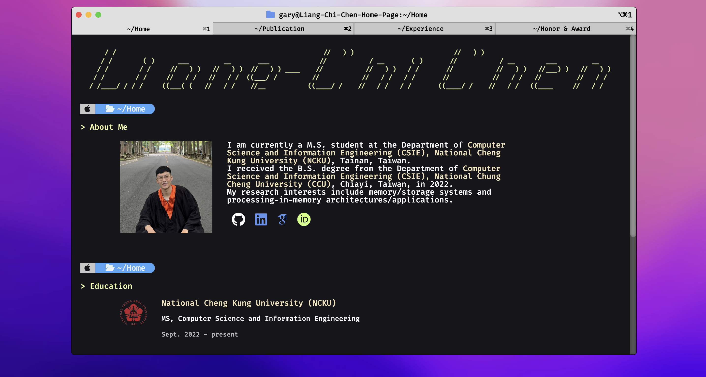
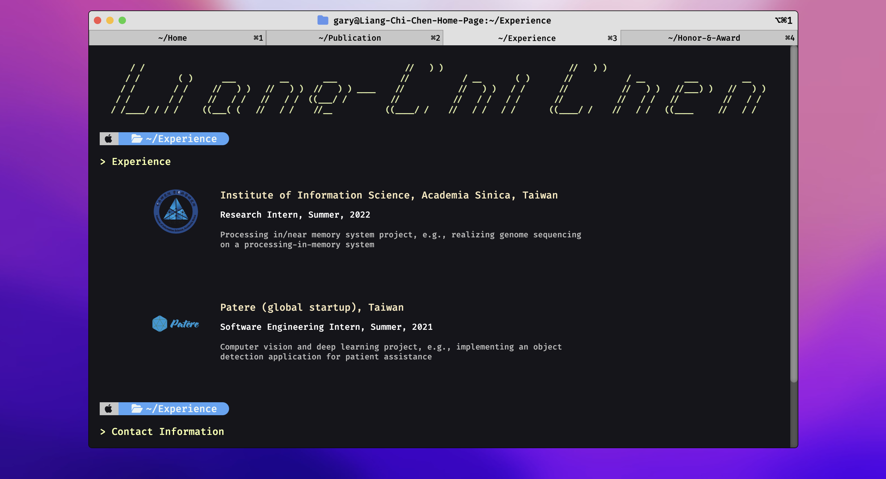
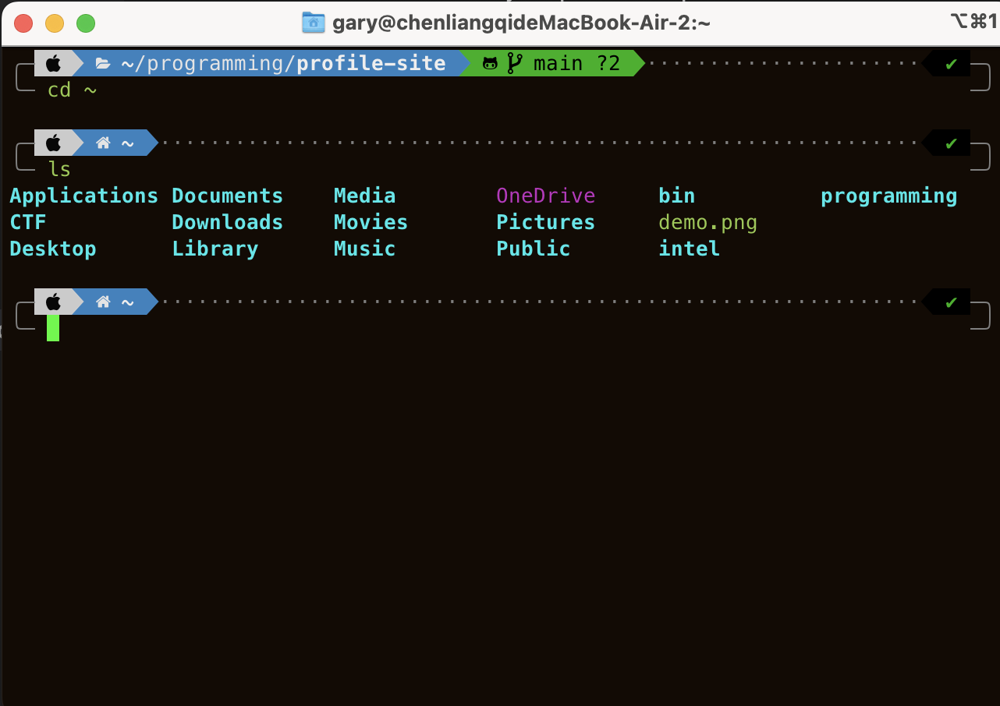

# profile-site
profile-site is a template of Macos terminal style personal profile website
- star this project if you enjoy this template

## Usage
``` shell=
git clone https://github.com/chi-0828/profile-site.git
cd profile-site
# change the introduction in *.html to your own information
# change the images in img/* to your own photo and your school/company logo
```

## Demo website link
[Demo](https://chi-0828.github.io/profile-site/)
## My personal website link
[Real usage](https://lcchen.me)

## Demo screenshot
#### Some demo images
ASCII art can be generated on an online tool, e.g., [patorjk](https://patorjk.com/software/taag/#p=display&f=Graffiti&t=Type%20Something%20)


#### This is the real Macos terminal (iTerm)



## TODO
The project is under-going
- add the animation of terminal-style text printing
- add a new tab for "Project"
- change the source code to React project
