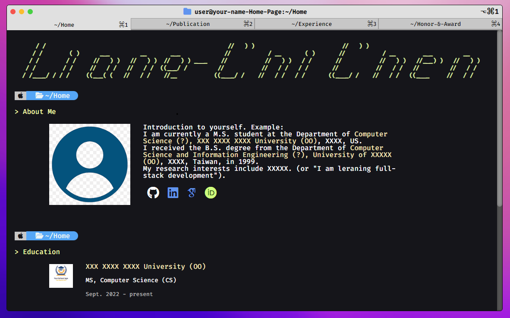

# profile-site
[](https://github.com/chi-0828/profile-site)
[](LICENSE)
[](https://docs.npmjs.com/)
[](https://nodejs.org/en)
profile-site is a template of MacOS terminal style personal profile website

- star this project if you enjoy this template

## [Try it out](#usage)

## Demo 
> #### Demo website link
> [see the demo website](https://chi-0828.github.io/profile-site/)
> #### My personal website link
> [see the website with real usage](https://lcchen.me)

## Demo screenshot
#### Some demo images
ASCII art can be generated on an online tool, e.g., [patorjk](https://patorjk.com/software/taag/#p=display&f=Graffiti&t=Type%20Something%20)


#### This is the real Macos terminal (iTerm)


## Usage
download the source
``` shell
git clone https://github.com/chi-0828/profile-site.git
```
run npm
``` shell
cd profile-site
npm install
npm run start
```
customize your website <br>
`src/img/me5.png` is your personal image, `src/customization/*.json` is your personal information
``` shell
cd src/customization
# change the introduction in *.json to your own information
# change the images in img/* to your own photo and your school/company logo
```
example-1: customize `Experience.json`
``` json
{
    "companies" : [
        {
            "logo" : "path related to src",
            "name" : "your company name",
            "position_time" : "your job title, when",
            "discription" : "what you do"
        },
        {
            "logo" : "./img/patere-removebg-preview.png",
            "name" : "XXXX Co.",
            "position_time" : "Software Engineering Intern, Aug. 2021 - Jun. 2022",
            "discription" : "Computer vision and deep learning project, e.g., implementing an object detection application for patient assistance"
        }
    ]
}
```
example-2: customize `Introduction.json`
``` json
{
    "intro" : "write your portfolio here",
    "github" : "your github",
    "googlescholar" : "your googles cholar (or your gmail)",
    "linkedin" : "your linkedin",
    "orcid" : "your orcid (or any other social account, e.g., FB, IG)"
}
```
if you don't have npm on your PC, I recommend you download it or use the HTML version
``` shell
git clone --branch html https://github.com/chi-0828/profile-site.git
```
if you want to depoly the site on your GitHub page
``` shell
git clone https://github.com/chi-0828/profile-site.git
cd profile-site
vim package.json
```
configure `package.json`
``` json
{
  "name": "profile-site", // name
  "version": "0.1.0",
  "homepage": "https://your-account.github.io/profile-site", // change "your-account" to your GitHub account and "profile-site" to repository
  "private": true,
  ...
}
```
``` shell
npm run deploy
```
There is a new branch `gh-pages` on your repository, you can host the branch to be the GitHub page in `setting`

## TODO
The project is under-going
- add the animation of terminal-style text printing
- add a new tab for "Project"
- change the source code to React project (done)
